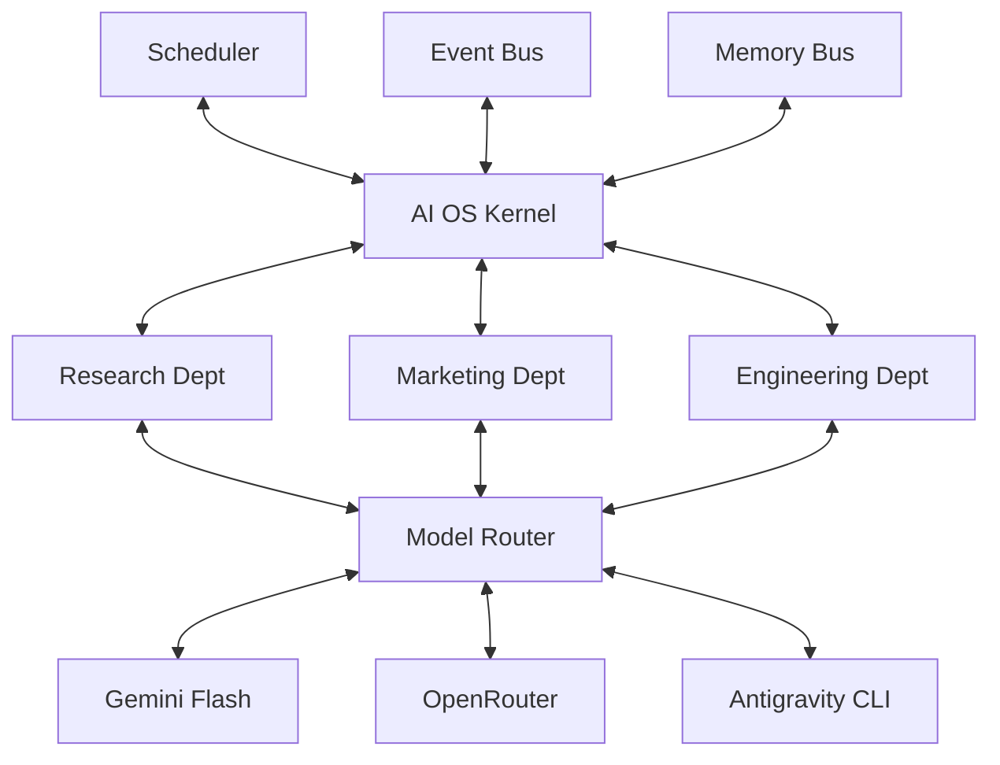

# AI OS Architecture

## Core Principles
1. **Model Agnostic**: Never depend on one provider.
2. **Cheap First**: Always choose the cheapest capable model.
3. **Human Approval**: Dangerous actions require approval.
4. **Modular**: Everything is replaceable.
5. **Event Driven**: Everything communicates through events.
6. **Persistent Memory**: No conversation memory, only structured knowledge.
7. **Department Based**: No random agents, only departments.
8. **Deterministic**: Every agent has one responsibility.

## The Kernel Architecture
The system is built around an **AI OS Kernel**. Everything—agents, departments, models, tools, memory—communicates only with the kernel.

### Communication
- **Standardized Events**: All components communicate via a strictly typed `Event` object (`id`, `source`, `destination`, `event_type`, `payload`, `timestamp`).
- **Event Bus**: Routes messages directly to destinations or broadcasts to all subscribers (`destination="*"`).
- **Module Registration**: Modules explicitly register themselves to the kernel at runtime via `kernel.register_module()`.

## Milestone Progress
- [x] **Milestone 1**: Kernel Core API (Interfaces, Data Models)
- [x] **Milestone 2**: Event Bus
- [x] **Milestone 3**: Agent Registry
- [x] **Milestone 4**: Task Scheduler
- [x] **Milestone 5**: Memory Engine
- [x] **Milestone 6**: Model Router
- [ ] **Milestone 7**: Departments (Research, Engineering, Marketing, etc.)
- [ ] **Milestone 8**: Dashboard
