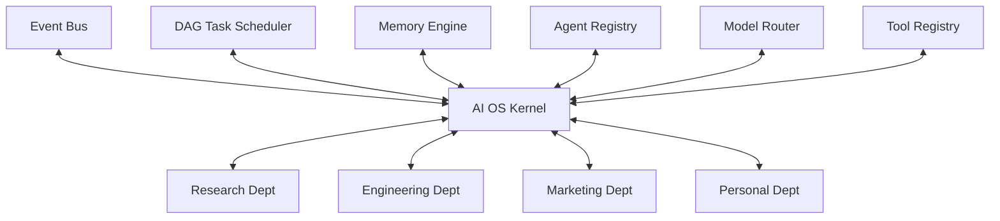
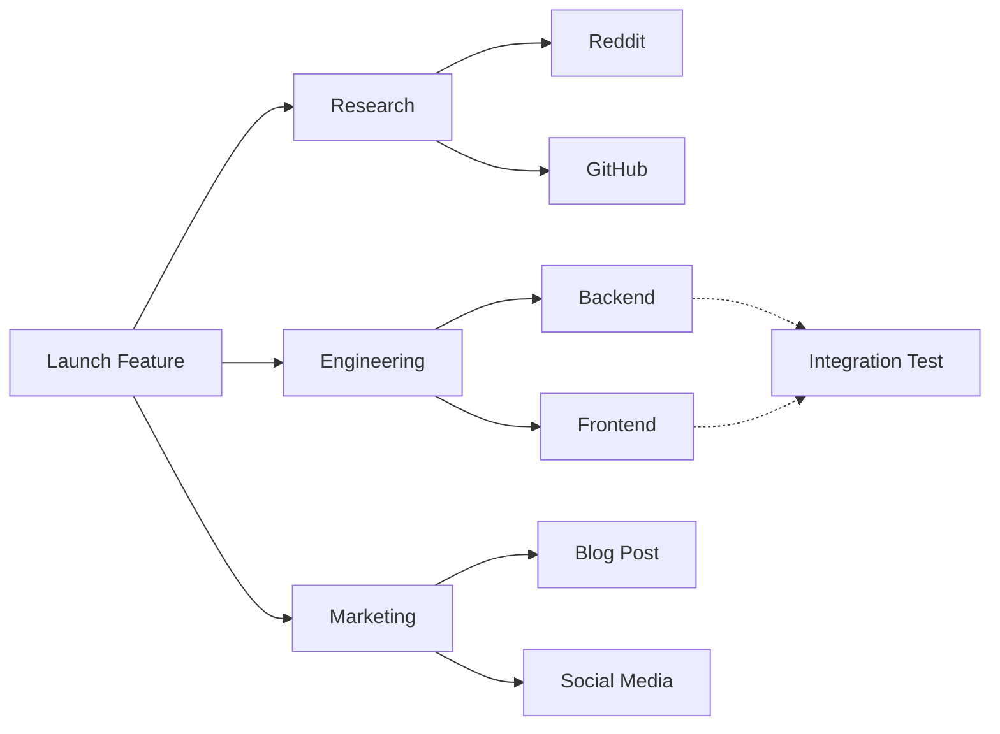

# 1. Overall System Architecture

## 1.1 Vision and Core Philosophy
The AI OS is designed not as a single chatbot or conversational assistant, but as a fully functional, autonomous software organization. It operates using strict departments, specialized roles, and persistent state. The system mimics a real company, complete with executives, managers, and specialized workers who communicate exclusively through well-defined events and task graphs, leaving behind permanent knowledge and artifacts.

### The "Day 1 Senior Engineer" Directives:
1. **Model Agnostic**: Never vendor-lock. The OS dynamically selects models (Gemini Flash, OpenRouter, Antigravity CLI) based on cost, context window, and task complexity.
2. **Event-Driven**: Components never invoke each other via blocking synchronous calls. Everything flows through a central Event Bus.
3. **Pluggable Kernel**: The OS is built around a central Kernel API. Every module (Scheduler, Memory, Routing, Departments) acts as a plugin. If a better Memory module is built tomorrow, it hot-swaps without affecting the rest of the OS.
4. **Task Graphs over Queues**: Real work is not linear. The OS executes Directed Acyclic Graphs (DAGs) of tasks, allowing parallel execution across departments.
5. **Artifact-Driven**: Every completed task yields a tangible artifact (e.g., `research.md`, `pr_diff.patch`), building the company's internal wiki and knowledge base over time.

## 1.2 The Kernel Topology
The system avoids a monolithic mesh network where agents talk directly to each other. Instead, it uses a **Star Topology** centered around the AI OS Kernel.



### The Rules of Engagement:
- **Agents** never talk directly to **Models**. They request execution from the **Model Router** via the **Kernel**.
- **Managers** never talk directly to **Workers**. They submit sub-tasks to the **Scheduler**, which queries the **Agent Registry** and assigns the task.
- **Workers** never execute code directly. They request capabilities from the **Tool Registry**.

## 1.3 The Organizational Hierarchy
Just like a real corporation, the OS scales infinitely by adding departments and specialized workers.

```text
CEO (User / Root Orchestrator)
 │
 ├── Research Department
 │    ├── Manager
 │    └── Workers: RedditAgent, GitHubAgent, TwitterAgent, HNAgent, PaperAgent
 │
 ├── Engineering Department
 │    ├── Manager
 │    └── Workers: BackendAgent, FrontendAgent, QAAgent, DevOpsAgent
 │
 ├── Marketing Department
 │    ├── Manager
 │    └── Workers: ContentAgent, SEOTool, SocialMediaAgent
 │
 └── Personal Department
      ├── Manager
      └── Workers: LifePlanner, EmailAgent, CalendarAgent
```

## 1.4 The Task Graph (DAG) Execution Model
Real organizations do not execute tasks sequentially. A "Launch Feature" task requires parallel efforts. The AI OS treats all high-level tasks as DAGs.


*Dependencies are strictly tracked. The Integration Test worker does not wake up until Backend and Frontend tasks emit `task.completed` events.*

## 1.5 The Artifact System
Conversational memory is transient and error-prone. The AI OS relies on **Artifacts**.
Every task execution culminates in the generation of a static file (Markdown, Code, JSON).
- `Research Worker` -> `reddit_analysis_2026.md`
- `Engineering Worker` -> `auth_service.py`
- `Marketing Worker` -> `launch_tweet.txt`

These artifacts are embedded by the Memory Engine and become the permanent, searchable context for future tasks.
